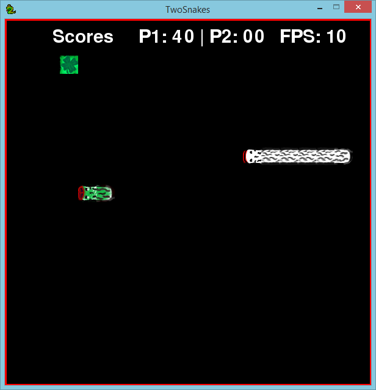

__TwoSnake Game__
===

A remake and modification of the __Snake Game__ with Pygame + Python! The game has better graphics, but yet, is not so GOOD. 

Myself even drew all sprites in photoshop manually (with mouse!). And I confess to all of you, I'm no talent in the art of drawing — unfortunately. The key central of this game is the idea to play with two players local a Snake Game! I (think) this very fun. I'm fight with my friends. Local game is very funs... it's nostalgic.

**NOTE: This software is alpha yet and your focus is the learning to control datas on logic games.**

__How to play?__

Player |     Keys    | Moviment 
------ | ----------- | --------
One    |      W      |    Up
One    |      A      |   Left
One    |      S      |   Down
One    |      D      |   Right
Two    |  Up arrow   |    Up
Two    |  Left arrow |   Left
Two    |  Down arrow |   Down
Two    |  Right arrow|   Right

__There's also action keys!__

 Key  |      Action       |
------| ----------------  |
 ESC  |  Pause game       |
 F1   |  Speed Up (FPS)   |
 F2   |  Speed Down (FPS) |
 R    |  Reset game       |

This game was write previously in python3 on Windows. But i have add other file to suport python2 + pygame on Linux, a dumb solution for that (in future i fix that correctly). 

You do <b>need</b> of:
  * [Python](https://www.python.org/)
  * [PyGame](http://www.pygame.org/download.shtml)
  
 

<b>Remind:</b> In linux, the standard python version for pygame is python 2.x, then use the version *_2.py if have problens with this! 

This project is license on __[Apache v2](http://www.apache.org/licenses/LICENSE-2.0.html)__!

===
<b>Roadmap:</b> 
  - [ ] When the some snake death: not restart game, but reboot that instance only (most important currently).
  - [ ] Background sprite and textures.
  - [ ] Generate random food with __perfect__ prevision to not generate below at any snake on the board.
  - [X] Sprites player with two colors diffs: head, body, turn and tail.
  - [X] A system with highscore and parser to verify and save on the exits of game the most highscore you won with that execution.
  - [x] Musics and other sounds interactives.
  - [X] Pause game

===
Contributors
 * Me (Manoel Vilela).

